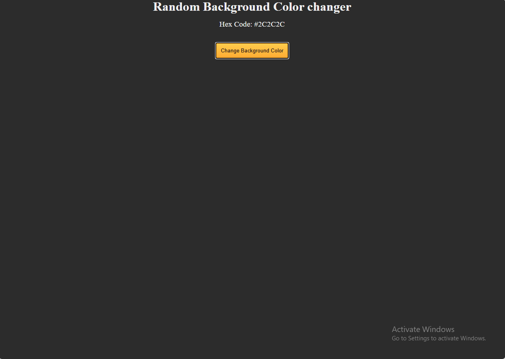

# Random Background Color Changer (freeCodeCamp Tutorial Project)

## 🖼️ Screenshot

## 📝 Description
A simple web app that changes the background to random dark colors. Built as part of freeCodeCamp's curriculum to practice DOM manipulation.

## 🎨 Features
- One-click background color change
- Displays current color's hex code
- Predefined elegant dark palette
- Responsive design
- Smooth button hover effects

## 🛠️ Technologies Used
- HTML5
- CSS3
- JavaScript (Vanilla JS)

## 🚀 How to Use
1. Open `index.html` in your browser
2. Click the button to change colors!

## 📂 Project Structure
random-bg-changer/
├── index.html      # Main HTML file
├── styles.css      # CSS styles
├── script.js       # JavaScript functionality
├── README.md       # Project documentation
└── screenshot.png  # App preview

text

## 🌈 Color Palette Examples
| Hex Code  | Color Preview                     |
|-----------|-----------------------------------|
| `#2C3E50` | 

 |
| `#34495E` | 

 |

## 📜 License
MIT License

## 🙏 Credits
- [freeCodeCamp](https://www.freecodecamp.org/) for the original project idea.

## 🌐 Live Demo
[Try it live!](https://abdulrahmanfrontend.github.io/random-dark-colors/)

⚠️ **Note**  
Created as part of freeCodeCamp's curriculum. Original requirements belong to freeCodeCamp.
